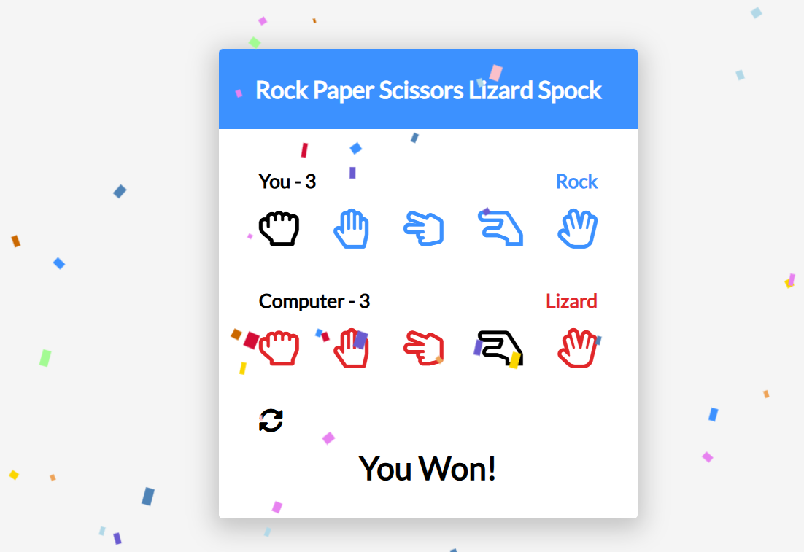

# Spock Rock Game

A fun and interactive **Spock Rock Paper Scissors Lizard** game built using **HTML**, **CSS**, and **JavaScript**. This twist on the classic game includes five choices instead of three, inspired by _The Big Bang Theory_!

---
## How to Play

Each player (you vs the computer) chooses one of the following:
- Rock
- Paper
- Scissors
- Lizard
- Spock

The winner is determined by the following rules:
- **Scissors** cuts **Paper**
- **Paper** covers **Rock**
- **Rock** crushes **Lizard**
- **Lizard** poisons **Spock**
- **Spock** smashes **Scissors**
- **Scissors** decapitates **Lizard**
- **Lizard** eats **Paper**
- **Paper** disproves **Spock**
- **Spock** vaporizes **Rock**
- **Rock** crushes **Scissors**

---
## Features

- Computer randomly selects a choice
- User selects one of five options via UI
- Game logic to determine winner
- Score tracking for player and computer
- Reset game functionality
- Responsive design for desktop and mobile
- Visual feedback for selected options

---
## Preview
[demo](https://abdo-rabea.github.io/spock-rock-game/)

---
## Technologies Used
- **HTML5** – Semantic structure
- **CSS3** – Custom styles and layout
- **JavaScript (ES6)** – Game mechanics and DOM interaction
- [confetti library](https://www.cssscript.com/confetti-falling-animation/)
